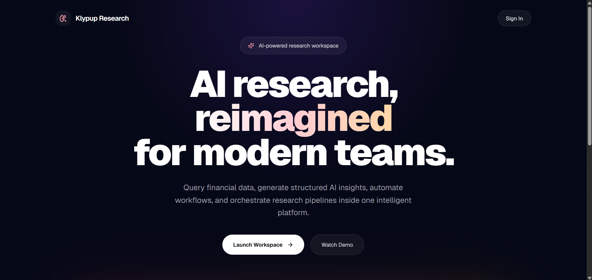
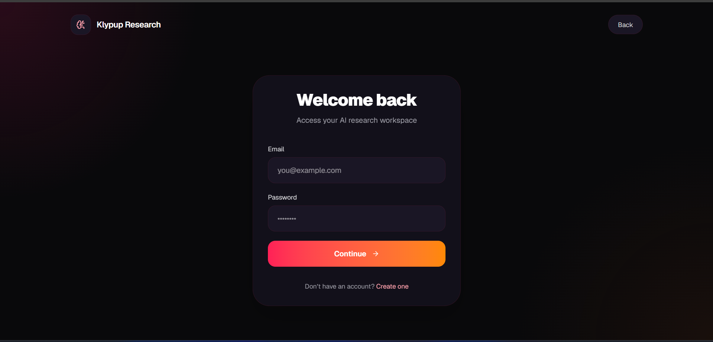
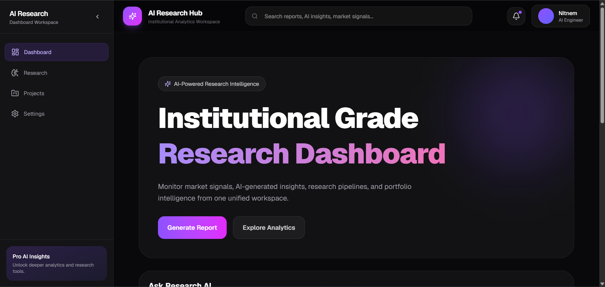
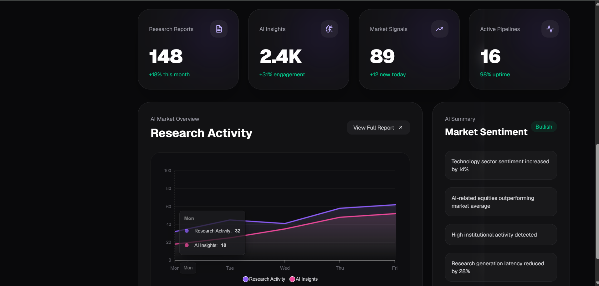
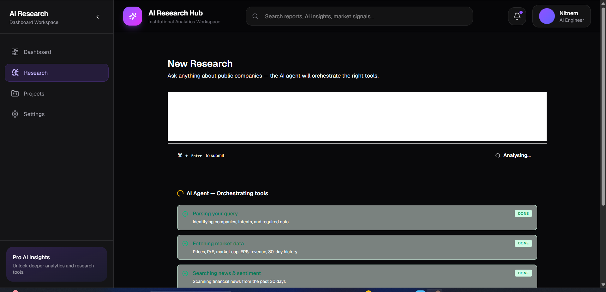

# AI Investment Research Dashboard

An AI-powered multi-tenant investment research platform built using Next.js, FastAPI, Supabase, and modern LLM orchestration workflows.

The platform enables users to generate structured AI-assisted investment research reports through a scalable full-stack architecture designed for SaaS-style extensibility.

---

# Live Deployment

## Frontend
https://ai-research-dashboard-4vub5xpya-nitnem-s-projects.vercel.app/login

## Backend API
https://ai-research-dashboard-8of2.onrender.com

---

# Project Overview

This project was developed as part of an AI Engineering internship assessment focused on:

- AI orchestration workflows
- Multi-tenant architecture
- Full-stack system design
- Production deployment
- Scalable backend engineering

The system combines a modern React frontend with a FastAPI backend and AI orchestration layer to automate research workflows and report generation.

---

# Core Features

## Authentication & Protected Routes
- Secure authentication flow
- Session persistence
- Protected dashboard routes
- Tenant-aware middleware architecture

## AI Research Workflow
- AI-assisted investment research generation
- Structured report workflows
- Modular LLM orchestration layer
- Extensible AI service design

## Dashboard & Reporting
- Interactive research dashboard
- Report generation and viewing
- Report history management
- Loading and error handling states

## Multi-Tenant Backend Design
- Tenant isolation middleware
- Scoped request handling
- Extensible SaaS-oriented architecture

## Production Deployment
- Frontend deployed on Vercel
- Backend deployed on Render
- Environment-based configuration
- CORS-secured API communication

---

# Tech Stack

## Frontend
- Next.js
- TypeScript
- Tailwind CSS
- App Router

## Backend
- FastAPI
- Python
- LiteLLM
- Sentence Transformers

## Infrastructure
- Supabase
- Vercel
- Render

---

# Project Structure

```text
AI_Research_Dashboard/
│
├── frontend/
├── backend/
├── screenshots/
│
├── README.md
├── ARCHITECTURE.md
├── DECISIONS.md
├── .env.example
└── .gitignore
```

---

# Local Development Setup

## 1. Clone Repository

```bash
git clone https://github.com/Nitnem06/AI_Research_Dashboard
cd AI_Research_Dashboard
```

---

# Frontend Setup

## 2. Navigate to Frontend

```bash
cd frontend
```

## 3. Install Dependencies

```bash
npm install
```

## 4. Create Frontend Environment File

Create:

```text
frontend/.env.local
```

Add:

```env
NEXT_PUBLIC_API_URL=http://localhost:8000
```

## 5. Start Frontend

```bash
npm run dev
```

Frontend runs on:

```text
http://localhost:3000
```

---

# Backend Setup

## 6. Navigate to Backend

Open a new terminal:

```bash
cd backend
```

## 7. Create Virtual Environment

### Windows

```bash
python -m venv venv
venv\Scripts\activate
```

### Mac/Linux

```bash
python3 -m venv venv
source venv/bin/activate
```

---

## 8. Install Backend Dependencies

```bash
pip install -r requirements.txt
```

---

## 9. Create Backend Environment File

Create:

```text
backend/.env
```

Add:

```env
SUPABASE_URL=
SUPABASE_KEY=
OPENROUTER_API_KEY=
JWT_SECRET=
FRONTEND_URL=http://localhost:3000
```

---

## 10. Start Backend Server

```bash
uvicorn app.main:app --reload
```

Backend runs on:

```text
http://localhost:8000
```

---

# Production Environment Variables

## Frontend (.env.local)

```env
NEXT_PUBLIC_API_URL=https://your-backend.onrender.com
```

## Backend (.env)

```env
SUPABASE_URL=
SUPABASE_KEY=
OPENROUTER_API_KEY=
JWT_SECRET=
FRONTEND_URL=https://your-frontend.vercel.app
```

---

# Architecture Overview

The platform follows a decoupled full-stack architecture:

```text
Next.js Frontend
        ↓
FastAPI Backend
        ↓
AI Orchestration Layer
        ↓
Supabase Database & Auth
```

Additional architecture details:
- `ARCHITECTURE.md`
- `DECISIONS.md`

---

# AI Workflow

```text
User Query
    ↓
Research API Endpoint
    ↓
AI Orchestration Layer
    ↓
LLM Processing
    ↓
Structured Report Generation
    ↓
Dashboard Rendering
```

---

# Screenshots

## Homepage



## Login



## Dashboard



## Market_Activity



## Research




---

# Challenges Solved

- Frontend production deployment issues
- TypeScript build compatibility
- Python AI dependency conflicts
- Multi-environment configuration
- Frontend/backend integration
- CORS handling
- Production branch synchronization

---

# Future Improvements

- Real-time AI streaming
- Vector search integration
- Background task queues
- Role-based access control
- Research collaboration workflows
- Advanced analytics dashboards

---

# Documentation

Additional technical documentation:

- `ARCHITECTURE.md`
- `DECISIONS.md`

---

# Author

Built by Nitnem Kaur Juneja.